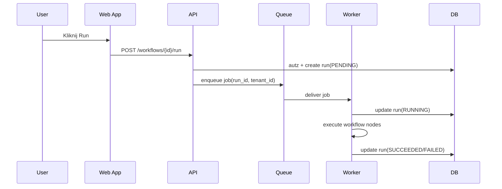
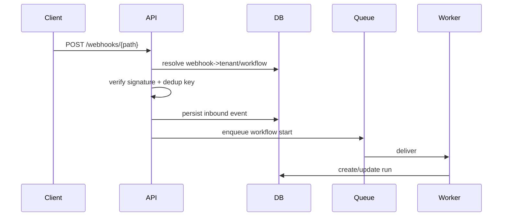
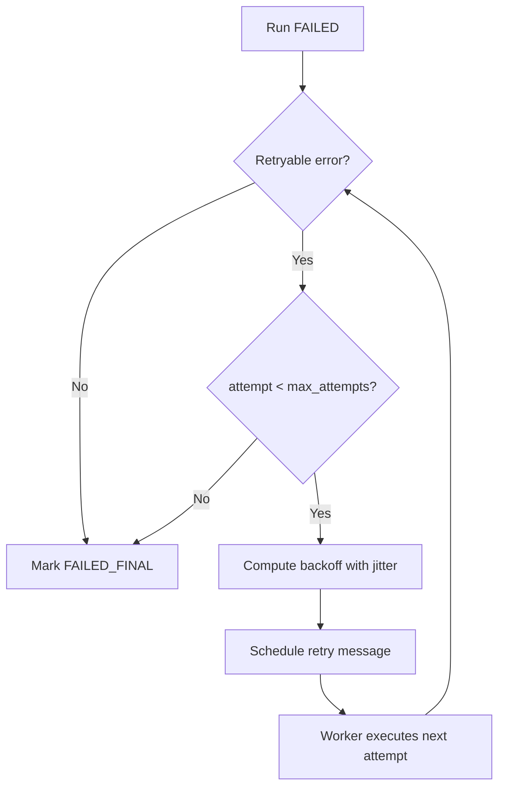
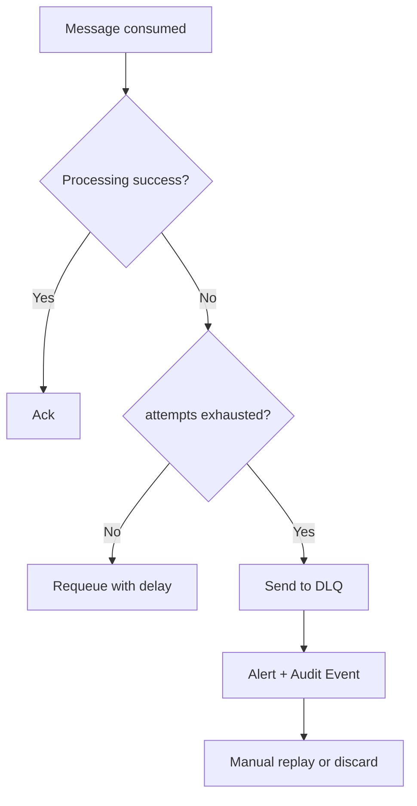

# System Design

## 1) Zakres i cele
Dokument opisuje architekturę wielotenantowej platformy workflow automation obejmującą serwisy, model danych, przepływy wykonania i polityki niezawodności (idempotencja, retry, deduplikacja, dead-letter).

## 2) Serwisy

### Web App
- UI dla użytkowników końcowych.
- Funkcje: zarządzanie organizacją, projektami, workflow, credentialami, billingiem i podgląd audit trail.
- Uwierzytelnianie przez API (JWT/OIDC).

### API
- Jedyny punkt wejścia dla klienta i webhooków.
- Odpowiada za autoryzację (RBAC), walidację danych, ustawienie kontekstu `tenant_id` i zapis do DB.
- Publikuje zdarzenia do kolejki (np. start workflow, retry, billing usage).

### Worker
- Konsumuje zadania z kolejki i wykonuje workflow.
- Obsługuje retry, timeouty, checkpointy, oraz zapisuje `runs` i logi wykonania.
- Egzekwuje limity per tenant (concurrency i rate).

### Scheduler
- Odpala workflow cykliczne (cron/time-based).
- Tworzy zadania startowe do kolejki z pełnym kontekstem `tenant_id`.
- Gwarantuje “at least once scheduling”, deduplikowane przez klucz idempotencji.

### Billing
- Zlicza usage events (uruchomienia, czas, webhook requests).
- Agreguje metryki do fakturowania i generuje `invoices`.
- Wystawia status planu i limity używane przez API/Worker.

### Audit
- Rejestruje zdarzenia bezpieczeństwa i operacje administracyjne.
- Write-once log (append-only), brak edycji rekordów.
- Eksport do SIEM / compliance reportingu.

## 3) Modele domenowe

### organizations
- `id`, `tenant_id`, `name`, `plan`, `status`, `created_at`.
- 1:N do `users`, `projects`, `invoices`.

### users
- `id`, `tenant_id`, `email`, `password_hash`/`external_auth_id`, `status`, `last_login_at`.
- N:M z rolami (przez tabelę wiążącą `user_roles`).

### roles
- `id`, `tenant_id`, `name`, `permissions` (JSON/bitset).
- RBAC scope: organization / project.

### projects
- `id`, `tenant_id`, `name`, `slug`, `status`.
- 1:N do `workflows`.

### workflows
- `id`, `tenant_id`, `project_id`, `name`, `version`, `definition`, `is_active`.
- Publikacja wersji immutable, aktywacja przez wskaźnik wersji.

### runs
- `id`, `tenant_id`, `workflow_id`, `trigger_type`, `status`, `attempt`, `started_at`, `finished_at`, `idempotency_key`.
- Logi node execution i metryki czasu.

### credentials
- `id`, `tenant_id`, `name`, `type`, `encrypted_blob`, `kms_key_ref`, `rotated_at`.
- Dostęp tylko przez role z uprawnieniem secret-read/use.

### webhooks
- `id`, `tenant_id`, `workflow_id`, `path`, `secret`, `is_active`, `rate_limit`.
- Mapowanie wejścia HTTP → trigger workflow.

### invoices
- `id`, `tenant_id`, `period_start`, `period_end`, `amount`, `currency`, `status`, `issued_at`, `due_at`.
- Powiązanie z agregatami usage i planem.

## 4) Przepływy (diagramy)

### 4.1 Uruchomienie workflow (manual/API trigger)

### 4.2 Webhook in

### 4.3 Retry policy

### 4.4 Dead-letter

## 5) Polityka idempotencji i deduplikacji eventów

## 5.1 Idempotencja (write path)
1. Każde żądanie uruchomienia workflow i webhook przyjmuje `idempotency_key`.
2. Klucz składa się z:
   - manual trigger: `tenant_id + workflow_id + client_request_id`
   - webhook: `tenant_id + webhook_id + provider_event_id` (lub hash payload).
3. W DB istnieje unikalny indeks na `(tenant_id, idempotency_key)` w tabeli `runs` lub `inbound_events`.
4. Duplikat zwraca ten sam `run_id`/status zamiast tworzyć nowy rekord.

## 5.2 Deduplikacja (async/event bus)
1. Każda wiadomość ma `event_id`, `tenant_id`, `occurred_at`.
2. Worker utrzymuje store przetworzonych `event_id` (TTL np. 7–30 dni).
3. Konsument pracuje w trybie co najmniej raz (at-least-once), a dedup zapewnia semantykę “effectively once”.
4. Replay z DLQ respektuje te same klucze dedup.

## 5.3 Retry i backoff
- Exponential backoff z jitter (np. 2^n * base + random).
- Klasyfikacja błędów:
  - retryable: timeout, 429, 5xx zależności.
  - non-retryable: walidacja, autoryzacja, błędy konfiguracji workflow.
- Max attempts zależny od triggera (np. webhook 5, scheduler 8).

## 5.4 Spójność i transakcje
- Wzorzec transactional outbox w API:
  1. zapis `run`/`event` i `outbox` w jednej transakcji,
  2. asynchroniczny publisher przesyła do kolejki,
  3. bez utraty zdarzeń między DB a brokerem.

## 5.5 Obserwowalność
- Metryki: duplicate_rate, retry_rate, dlq_depth, run_latency.
- Trace z `correlation_id` i `tenant_id` na całej ścieżce.
- Alerty SLO: wzrost DLQ, przekroczenie czasu wykonania, spike duplikatów.
